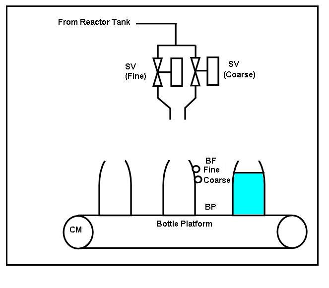

### Implement bottle filling plant logic using DCS

At this stage we are aware of various function blocks available in the dcs library. In the traffic control application we have seen how on delay timers (OND block) are used. Let us see another example for logic development.
The P & I diagram for bottle filling plant is shown here.

To start the process, command is given by the field operator as well as from the control room i.e. through DCS.
The Conveyor belt starts running when conveyor motor (CM) is switched on. The bottles are kept manually on the conveyor belt. When bottle is reached below the filling solenoid valves (SV); detected by a limit switch (BP), CM stops.
The filling process starts by opening SV, when the bottle is raised up by raising the platform by pneumatic cylinder. The time required to raise the bottle is 5 seconds.
Upto 90% filling takes place through solenoid valve (coarse) and remaining 10% (100% full condition) by opening solenoid valve (fine).
Bottle 90% full condition is sensed by proximity switch (coarse) . Bottle 100% full condition is sensed by another proximity switch (fine). When bottle is full SV should become off and the count is displayed. When SV is closed, CM runs again till next bottle is detected by BP switch and the cycle repeats.